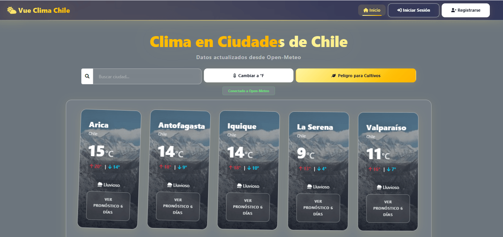
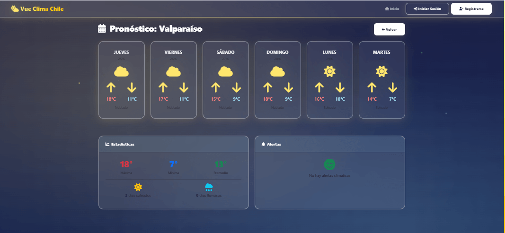
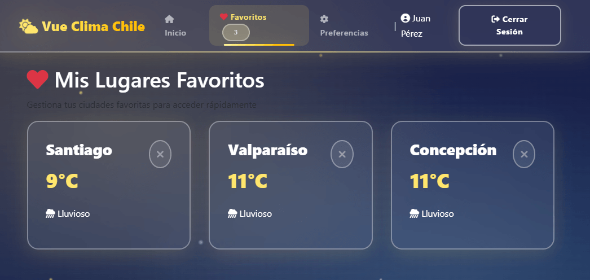
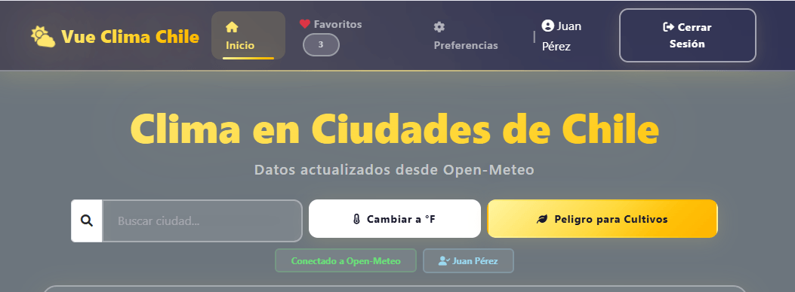

# Vue Clima Chile

Aplicación web de clima desarrollada con **Vue 3** que permite consultar el pronóstico de ciudades chilenas, con sistema de autenticación de usuarios y personalización de preferencias.

---

## Tecnologías

| Tecnología | Versión | Descripción |
|---|---|---|
|  Vue.js | 3.4.0 | Framework progresivo para interfaces de usuario |
|  Vue Router | 4.2.5 | Enrutador oficial para Vue.js |
|  Vuex | 4.1.0 | Gestión de estado centralizada |
|  Vite | 6.4.3 | Bundler ultrarrápido para desarrollo |
|  Axios | 1.6.0 | Cliente HTTP para peticiones API |
|  Bootstrap | 5.3.8 | Framework CSS para diseño responsive |
|  Font Awesome | 6.0.0 | Biblioteca de iconos vectoriales |

---

## Estructura del Proyecto


---

## Funcionalidades

### Autenticacion
- Registro de nuevos usuarios
- Inicio de sesion con credenciales
- Cierre de sesion
- Persistencia de sesion con localStorage
- Proteccion de rutas con Navigation Guards

### Clima
- Consulta de clima actual por ciudad
- Pronostico extendido a 6 dias
- Estadisticas semanales (temperaturas, dias soleados/lluviosos)
- Alertas climaticas personalizadas

### Personalizacion
- Gestion de ciudades favoritas por usuario
- Cambio entre C y F
- Tema claro/oscuro
- Informacion de perfil de usuario

---

## Requisitos Previos

- Node.js v16 o superior
- npm v8 o superior
- Git para clonar el repositorio

---

## Instalacion y Configuracion

1. Clonar el Repositorio

```bash
git clone https://github.com/NelDurv/App-Clima-Usuarios-Login-y-Estado-Global.git
cd "modulo7 App"
```

2. Instalar Dependencias

```bash
npm install --legacy-peer-deps
```

3. Ejecutar en Desarrollo

```bash
npm run dev
```

La aplicacion estara disponible en `http://localhost:5173`

4. Construir para Produccion

```bash
npm run build
```

5. Vista Previa de Produccion

```bash
npm run preview
```

---

## Scripts Disponibles

| Comando | Descripcion |
|---|---|
| `npm run dev` | Inicia servidor de desarrollo |
| `npm run build` | Construye para produccion |
| `npm run preview` | Vista previa de produccion |
| `npm run test:unit` | Ejecuta pruebas unitarias |
| `npm run test:unit:watch` | Pruebas en modo watch |
| `npm run test:unit:coverage` | Pruebas con cobertura |

---

## Credenciales de Demo

| Email | Contrasena | Nombre |
|---|---|---|
| juan@email.com | 123456 | Juan Perez |
| maria@email.com | 123456 | Maria Gonzalez |
| carlos@email.com | 123456 | Carlos Rojas |

---

## API Utilizada

La aplicacion consume datos de [Open-Meteo API](https://open-meteo.com/):

- **Clima actual:** `https://api.open-meteo.com/v1/forecast`
- **Pronostico diario:** Parametros `daily` para 7 dias
- **Datos de fallback:** En caso de error en la API, se utilizan datos locales simulados.

---

## Capturas de Pantalla

### Pagina Principal


### Pronostico 6 dias


### Favoritos


### Sesion de Usuario


---

## Contribucion

1. Fork el repositorio
2. Crea una rama: `git checkout -b feature/nueva-funcionalidad`
3. Realiza tus cambios y commit: `git commit -m 'feat: descripcion'`
4. Push a la rama: `git push origin feature/nueva-funcionalidad`
5. Abre un Pull Request

---

## Licencia

Este proyecto esta bajo la licencia MIT.

---

## Contacto

**Desarrollador:** NelDur  
**GitHub:** [NelDurv/App-Clima-Usuarios-Login-y-Estado-Global](https://github.com/NelDurv/App-Clima-Usuarios-Login-y-Estado-Global)

---

## Agradecimientos

- [Open-Meteo](https://open-meteo.com/) por su excelente API de clima gratuita
- [Bootstrap](https://getbootstrap.com/) por su framework CSS
- [Font Awesome](https://fontawesome.com/) por sus iconos

---

Hecho con Vue.js
